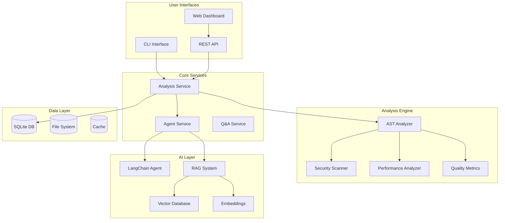

# Architecture Documentation

## System Overview

The Code Quality Intelligence Agent (CQIA) is a sophisticated multi-layered system that combines traditional static analysis with modern AI capabilities to provide comprehensive code quality insights.

## High-Level Architecture



## Component Details

### 1. User Interfaces

#### CLI Interface (`backend/cli.py`)
- **Purpose**: Primary interface for developers
- **Features**: 
  - Local file/directory analysis
  - Multiple output formats (table, JSON, markdown)
  - Interactive Q&A mode
  - Progress tracking with rich UI
- **Technology**: Click + Rich for beautiful terminal UI

#### Web Dashboard (`app/`, `components/`)
- **Purpose**: Visual interface for comprehensive analysis
- **Features**:
  - Drag-and-drop file upload
  - GitHub repository analysis
  - Interactive charts and visualizations
  - Real-time chat with AI agent
- **Technology**: Next.js 15 + React 19 + Tailwind CSS

#### REST API (`backend/app/api/`)
- **Purpose**: Backend service layer
- **Endpoints**:
  - `/api/v1/analyze` - Start analysis
  - `/api/v1/analyze/{id}/status` - Check progress
  - `/api/v1/qa/ask` - Q&A interface
- **Technology**: FastAPI with async support

### 2. Core Services

#### Analysis Service (`backend/app/services/analysis_service.py`)
- **Purpose**: Orchestrates the entire analysis workflow
- **Responsibilities**:
  - Background task management
  - Results aggregation and enhancement
  - Progress tracking
  - Technical debt estimation
- **Key Features**:
  - Async processing
  - Intelligent issue prioritization
  - Contextual recommendations
  - Severity scoring

#### Agent Service (`backend/app/services/agent_service.py`)
- **Purpose**: AI-powered conversational interface
- **Responsibilities**:
  - Natural language question processing
  - Context-aware responses
  - RAG integration
  - Tool orchestration
- **Technology**: LangChain with ReAct pattern

### 3. Analysis Engine

#### AST Analyzer (`backend/app/services/ast_analyzer.py`)
- **Purpose**: Deep structural code analysis
- **Supported Languages**: Python, JavaScript, TypeScript, Java, Go, Rust, C#
- **Analysis Types**:
  - **Security**: Hardcoded credentials, unsafe functions, injection risks
  - **Performance**: Inefficient loops, memory leaks, complexity issues
  - **Quality**: Function length, parameter count, documentation gaps
  - **Structure**: Class/function extraction, dependency mapping

#### Multi-Language Support Strategy
```python
# Language-specific analyzers
analyzers = {
    '.py': PythonASTAnalyzer,    # Full AST parsing
    '.js': JavaScriptAnalyzer,   # Regex + pattern matching
    '.ts': TypeScriptAnalyzer,   # Enhanced JS analysis
    '.java': JavaAnalyzer,       # Basic pattern matching
    '.go': GoAnalyzer,           # Pattern-based analysis
    '.rs': RustAnalyzer,         # Pattern-based analysis
}
```

### 4. AI Layer

#### LangChain Integration
- **Agent Pattern**: ReAct (Reasoning + Acting)
- **Tools Available**:
  - `analyze_code_quality`: Deep analysis insights
  - `explain_issue`: Detailed issue explanations
  - `suggest_fix`: Actionable fix recommendations
  - `search_codebase`: Semantic code search

#### RAG System
- **Purpose**: Handle large codebases efficiently
- **Components**:
  - **Text Splitter**: Recursive character splitting
  - **Embeddings**: HuggingFace sentence-transformers
  - **Vector Store**: ChromaDB for similarity search
  - **Retrieval**: Top-K relevant code chunks

#### Fallback Strategy
```python
# Graceful degradation when LLM unavailable
if ollama_available:
    use_langchain_agent()
elif huggingface_available:
    use_huggingface_fallback()
else:
    use_rule_based_responses()
```

### 5. Data Flow

#### Analysis Workflow
1. **Input Processing**: File collection and validation
2. **AST Parsing**: Language-specific structural analysis
3. **Issue Detection**: Multi-category problem identification
4. **AI Enhancement**: LLM-powered insights and prioritization
5. **RAG Setup**: Vector indexing for Q&A
6. **Report Generation**: Comprehensive results compilation

#### Q&A Workflow
1. **Question Processing**: Natural language understanding
2. **Context Retrieval**: RAG-based relevant information
3. **Agent Reasoning**: LangChain tool orchestration
4. **Response Generation**: Contextual, actionable answers

## Design Decisions & Trade-offs

### 1. Multi-Language Support Strategy

**Decision**: Hybrid approach combining AST parsing and pattern matching
**Rationale**: 
- Full AST parsing for Python (mature ecosystem)
- Pattern matching for others (faster implementation)
- Extensible architecture for future enhancements

**Trade-offs**:
- ✅ Rapid multi-language support
- ✅ Consistent interface across languages
- ❌ Less precision for non-AST languages
- ❌ Requires language-specific tuning

### 2. AI Framework Choice

**Decision**: LangChain with Ollama integration
**Rationale**:
- Local LLM execution (privacy + performance)
- Rich agent ecosystem
- Fallback mechanisms for reliability

**Trade-offs**:
- ✅ Privacy-preserving local execution
- ✅ Rich tooling and agent patterns
- ✅ Extensible architecture
- ❌ Requires Ollama installation
- ❌ Higher resource requirements

### 3. Database Strategy

**Decision**: SQLite for simplicity, ChromaDB for vectors
**Rationale**:
- SQLite: Zero-config, embedded, sufficient for demo
- ChromaDB: Optimized for vector operations

**Trade-offs**:
- ✅ Simple deployment and setup
- ✅ No external dependencies
- ❌ Limited scalability
- ❌ Single-user focused

### 4. Frontend Architecture

**Decision**: Next.js with server-side rendering
**Rationale**:
- Modern React ecosystem
- Built-in API routes
- Excellent developer experience

**Trade-offs**:
- ✅ Rich UI component ecosystem
- ✅ Great performance and SEO
- ✅ TypeScript support
- ❌ Heavier than simple SPA
- ❌ Node.js dependency

## Performance Considerations

### 1. Analysis Performance
- **Async Processing**: Background tasks prevent UI blocking
- **File Size Limits**: 1MB per file, 100MB per repository
- **Chunking Strategy**: Process large files in manageable chunks
- **Caching**: Results cached by file hash for repeat analysis

### 2. AI Performance
- **Local LLM**: Ollama provides fast local inference
- **RAG Optimization**: Efficient vector similarity search
- **Response Caching**: Common questions cached for speed
- **Fallback Mechanisms**: Graceful degradation when AI unavailable

### 3. Memory Management
- **Streaming Processing**: Large files processed in streams
- **Vector Store Persistence**: ChromaDB persists to disk
- **Garbage Collection**: Explicit cleanup of analysis artifacts

## Security Considerations

### 1. Code Privacy
- **Local Processing**: All analysis happens locally
- **No Data Transmission**: Code never leaves user's machine
- **Secure Storage**: Temporary files cleaned up after analysis

### 2. Input Validation
- **File Type Validation**: Only supported code files processed
- **Size Limits**: Prevent resource exhaustion attacks
- **Path Traversal Protection**: Secure file path handling

### 3. API Security
- **Rate Limiting**: Prevent abuse of API endpoints
- **Input Sanitization**: All inputs validated and sanitized
- **Error Handling**: No sensitive information in error messages

## Scalability & Extensibility

### 1. Language Extension
```python
# Adding new language support
class NewLanguageAnalyzer(BaseAnalyzer):
    def analyze(self, content: str) -> AnalysisResult:
        # Implement language-specific analysis
        pass

# Register in analyzer factory
ANALYZERS['.newext'] = NewLanguageAnalyzer
```

### 2. Analysis Extension
```python
# Adding new analysis types
class CustomAnalyzer:
    def analyze_custom_patterns(self, ast_tree):
        # Custom analysis logic
        pass
```

### 3. Agent Tool Extension
```python
# Adding new agent tools
new_tool = Tool(
    name="custom_analysis",
    description="Perform custom analysis",
    func=custom_analysis_function
)
agent.tools.append(new_tool)
```

## Deployment Architecture

### Development
```
┌─────────────┐    ┌─────────────┐
│ Next.js Dev │    │ FastAPI Dev │
│ :3000       │    │ :8000       │
└─────────────┘    └─────────────┘
       │                   │
       └───────────────────┘
              │
    ┌─────────────────┐
    │ Local Ollama    │
    │ :11434          │
    └─────────────────┘
```

### Production
```
┌─────────────┐    ┌─────────────┐    ┌─────────────┐
│ Nginx       │    │ Gunicorn    │    │ Ollama      │
│ (Static)    │    │ (API)       │    │ (LLM)       │
└─────────────┘    └─────────────┘    └─────────────┘
       │                   │                   │
       └───────────────────┼───────────────────┘
                           │
                  ┌─────────────────┐
                  │ SQLite + Vector │
                  │ Storage         │
                  └─────────────────┘
```

## Future Enhancements

### 1. Advanced Analysis
- **Dependency Graph Visualization**: Interactive code relationship maps
- **Trend Analysis**: Quality metrics over time
- **Custom Rules Engine**: User-defined analysis patterns

### 2. Integration Capabilities
- **CI/CD Integration**: GitHub Actions, GitLab CI
- **IDE Plugins**: VSCode, IntelliJ extensions
- **Webhook Support**: Real-time notifications

### 3. Collaborative Features
- **Team Dashboards**: Shared quality metrics
- **Code Review Integration**: PR analysis and suggestions
- **Quality Gates**: Automated quality thresholds

This architecture provides a solid foundation for a production-ready code quality intelligence system while maintaining simplicity and extensibility.